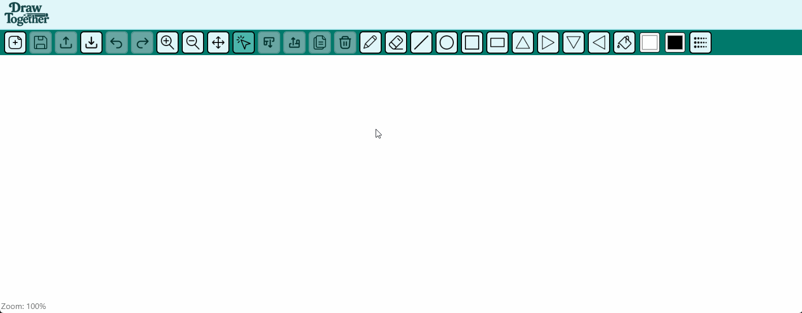
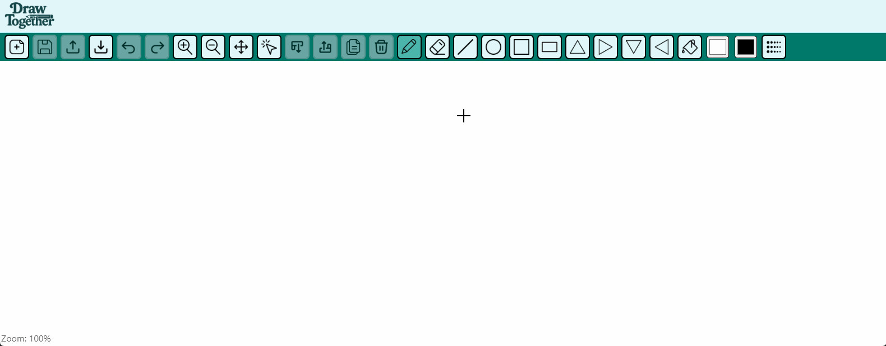
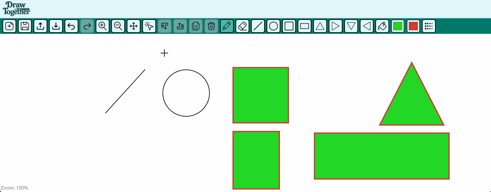
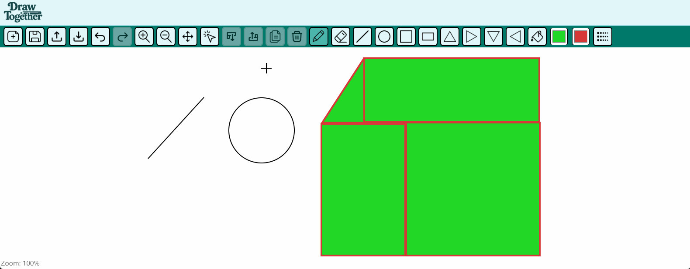
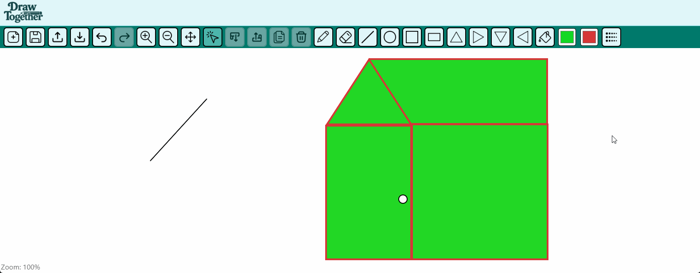
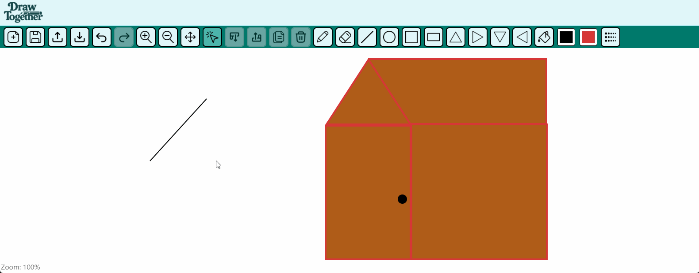
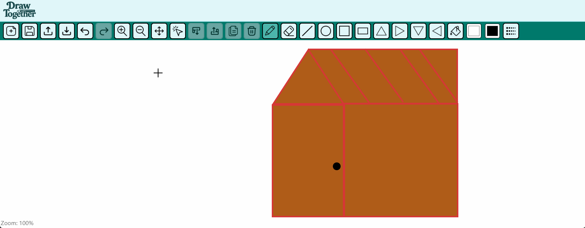
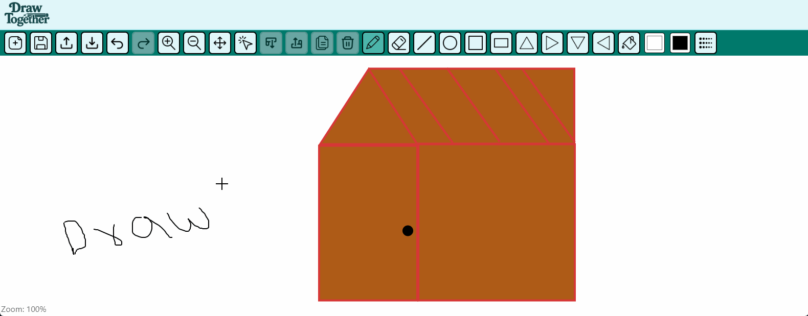

# 🎨 Draw Together – Interactive Drawing App

**Draw Together** is a browser-based vector drawing app built with **React**, **TypeScript**, and the **Canvas API**. Inspired by tools like Figma and Excalidraw, it allows users to draw, move, resize, copy, delete, recolor, reorder shapes, and export/import their canvas work.

---

🔗 **Live Demo:** [https://draw-together-hjar.onrender.com/](https://draw-together-hjar.onrender.com/)  
💻 **GitHub Repo:** [https://github.com/azeemabrarkhan/Draw-Together](https://github.com/azeemabrarkhan/Draw-Together)

---

## 🧑‍💻 Tech Stack

| Layer                 | Tools                               |
| --------------------- | ----------------------------------- |
| **Frontend**          | React + TypeScript                  |
| **Canvas Rendering**  | HTML5 Canvas API                    |
| **UI/UX**             | Custom CSS, Tooltips, Cursors       |
| **State Handling**    | React Hooks, `useRef`, `useReducer` |
| **Deployment**        | Render.com                          |
| **Testing (planned)** | Jest, Playwright                    |

---

## 🚀 Features

### 🧰 Drawing Tools

- Freehand Pencil and Eraser
- Line, Circle, Square, Rectangle, Triangles (Up, Down, Left, Right)

### 🖱️ Shape Interaction

- Shape selection with bounding box
- Move & resize shapes
- Copy and delete shapes
- Z-index preservation on all edits (Bring forward / Send backward)

### 🎨 Appearance & UX

- Stroke/fill color pickers
- Custom cursors (pencil, bucket, eraser, move, etc.)
- Zoom and pan controls
- Undo/redo support
- Tooltips for all icons

### 💾 Save, Export & Import

- Save canvas as `.jpeg` image
- Export your canvas as an encoded file
- Load previous work via import

---

## 🖼️ Demo GIFs

### ✏️ Draw Freehand & Erase



### 🔷 Draw Shapes



### 🔁 Move & Resize



### 🧱 Bring Forward / Send Backward



### 🎨 Recolor Shapes



### 📋 Copy & ❌ Delete



### 🧭 Zoom & Pan



### ↩️ Undo & Redo


### 🖼️ Save as Image


### 📂 Import & Export



---

## 📦 Installation

```bash
# Clone the repo
git clone https://github.com/azeemabrarkhan/Draw-Together.git

# Enter the project directory
cd Draw-Together/frontend

# Install dependencies
npm install

# Start the development server
npm run dev
```

---

## 🎯 What I Learned

- Managing complex canvas state using React hooks
- Handling real-time interactions (move, resize, delete, copy, fill, undo, redo)
- Creating a UX-friendly design with custom cursors and tooltips
- Dynamic z-index tracking and re-rendering shapes in correct order
- File saving, importing, and exporting for persistent drawings

---

## 🧠 Future Improvements

- 🔗 Backend server with WebSocket support for real-time collaboration
- 🧱 Group shape selection
- 🔤 Text insertion tool
- 📐 Snap to grid and alignment guides
- 🌙 Theme toggle (dark mode)
- 🔄 Shape rotation and transformation

---

## 👤 About the Developer

**Azeem Abrar Khan**  
💼 Fullstack Developer
🌍 Based in Hamburg, Germany | 🇩🇪
🎯 Focus: React, TypeScript, NodeJs, MongoDB, UI/UX, interactive web apps  
🔗 [LinkedIn](https://linkedin.com/in/azeem-abrar-khan)  
💻 [GitHub](https://github.com/azeemabrarkhan)
